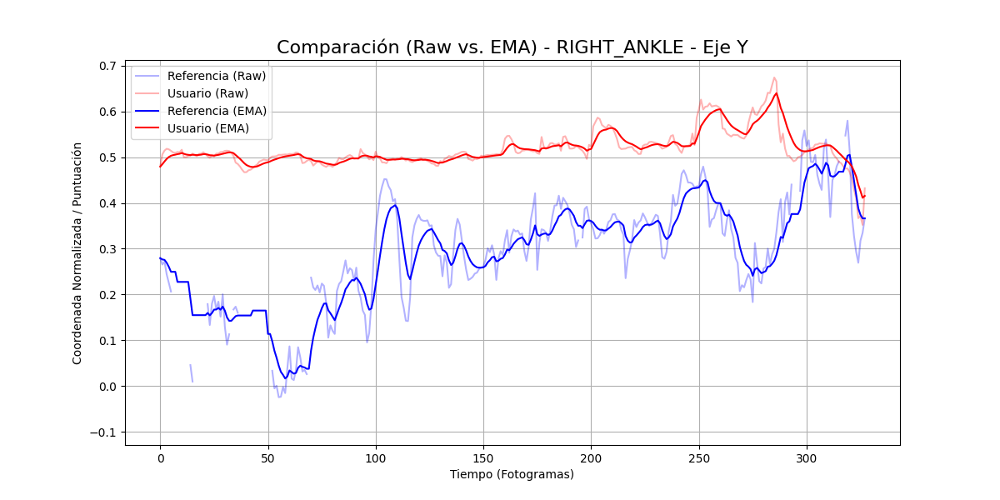

# Reporte de Sesión de Baile

**Fecha y Hora:** 2025-06-21 21:33:12

---

## Resumen de Rendimiento

| Métrica | Valor |
|---|---|
| **Puntuación Media General** | **62.84 %** |
| Precisión Media | 73.48 % |
| Consistencia (Desv. Est.) | 16.39 |
| **Mejor Articulación** | `LEFT_HIP` |
| **Articulación a Mejorar** | `RIGHT_WRIST` |

---

## Análisis Detallado

### Precisión General de la Sesión (con filtro EMA)

### Desglose por Articulación (Ejes X, Y) - Raw vs. EMA
Las líneas tenues representan los datos en crudo, mientras que las líneas sólidas y opacas muestran la tendencia suavizada con el filtro EMA.

#### Muñecas (Wrists)

#### Caderas (Hips)

#### Rodillas (Knees)

#### Tobillos (Ankles)

